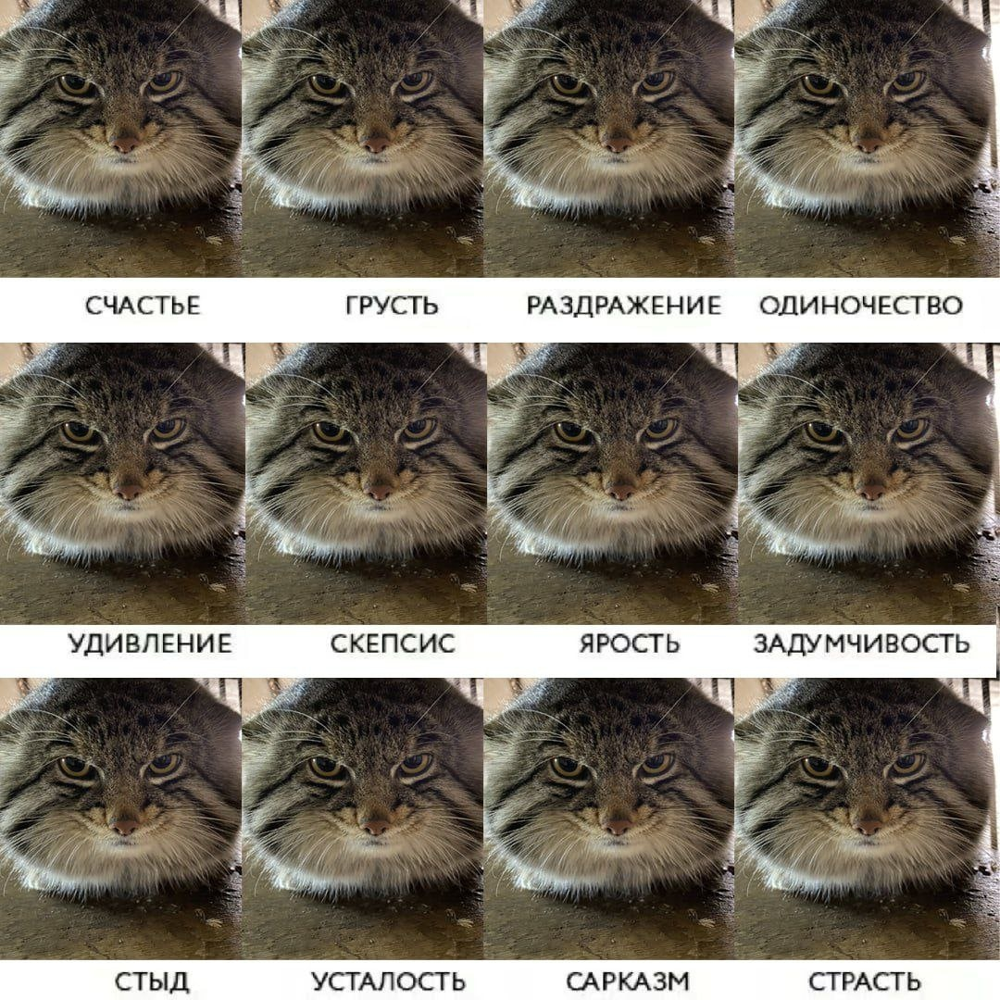
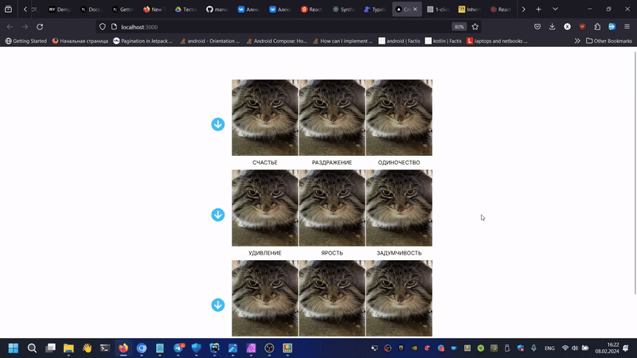

Это [Next.js](https://nextjs.org/)-ня проект созданный с помощью [`create-next-app`](https://github.com/vercel/next.js/tree/canary/packages/create-next-app).

## История



Прекрасный мем-ня. Но есть проблемочка! Он не использует [rc-table](https://www.npmjs.com/package/rc-table)! Это ужасно-няяя.....



Каждый 4-й манул само собой прячется-ня!

## Запуск

Рррр запускаем dev-сервер:

```bash
npm run dev
# or
yarn dev
# or
pnpm dev
# or
bun dev
```

Открываем [http://localhost:3000](http://localhost:3000) с помощью браузера и наслаждаемся няяя~~~.